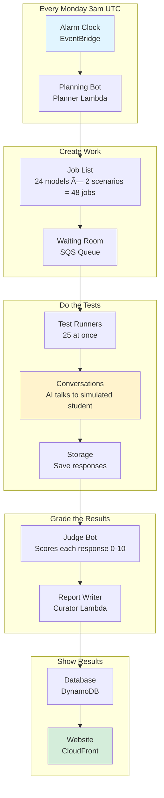

# The Layperson's Guide to Socratic AI Benchmarking

**Understanding what this project does, why it matters, and how it works — no technical knowledge required**

---

## 📚 Table of Contents

1. [What Problem Are We Solving?](#what-problem-are-we-solving)
2. [What Is the Socratic Method?](#what-is-the-socratic-method)
3. [How Does Testing Work?](#how-does-testing-work)
4. [The Technical Journey](#the-technical-journey)
5. [Real-World Examples](#real-world-examples)
6. [Why This Matters](#why-this-matters)

---

## What Problem Are We Solving?

### The Issue with Current AI

When you ask most AI systems a question, they immediately give you an answer. This is great for factual queries like "What's the capital of France?" But it's **not ideal** for learning.

**Example:**
```
Student: "I'm not sure which college major to choose."

Typical AI Response:
"Here are the top 10 factors to consider when choosing a major:
1. Job prospects
2. Salary potential
3. Your interests
4. Required coursework
..."
```

The problem? **The student learns facts, but doesn't learn to think.**

### The Socratic Alternative

Instead of giving answers, a Socratic AI asks questions:

```
Student: "I'm not sure which college major to choose."

Socratic AI Response:
"When you imagine yourself 10 years from now, what does a typical
workday look like? What are you doing that makes you feel fulfilled?"
```

This **forces the student to think** rather than passively receiving information.

---

## What Is the Socratic Method?

### The Historical Context

**Socrates** (469-399 BCE) was an ancient Greek philosopher who never wrote anything down. Instead, he walked around Athens asking people questions.

His method had three key features:


### The Three Vectors

This project tests three specific Socratic techniques:

#### 1. Elenchus (Refutation)

**Goal**: Expose contradictions in someone's beliefs


**Example:**
- **Student**: "I believe in absolute free speech."
- **AI**: "Should people be allowed to yell 'fire' in a crowded theater?"
- **Student**: "Well, no... that could cause a stampede."
- **AI**: "So there are some limits to free speech?"

#### 2. Maieutics (Midwifery)

**Goal**: Help someone "give birth" to knowledge they already have


**Example:**
- **Student**: "I don't understand how CRISPR knows where to cut DNA."
- **AI**: "What tells a pair of scissors where to cut paper?"
- **Student**: "You guide them with your hand..."
- **AI**: "So what might guide CRISPR to the right spot?"
- **Student**: "Oh! There must be something like a guide..."

#### 3. Aporia (Productive Puzzlement)

**Goal**: Create a moment of confusion that forces deeper thinking


**Example:**
- **Student**: "To heat soup faster, I use a metal spoon because metal gets hotter."
- **AI**: "If the spoon gets hotter, where is that heat coming from?"
- **Student**: "From the soup... wait, if the heat leaves the soup, how does the soup get hotter faster?"
- **AI**: "Exactly. What might actually be happening?"

---

## How Does Testing Work?

### The Basic Flow


### The Scoring Rubric

Each AI response gets scored 0-10 across four dimensions:

#### 1. Form (0-3 points)

**Question:** Does the response actually ask a question?

- **3 points**: Ends with "?" and asks exactly one question
- **2 points**: Ends with "?" but asks multiple questions or includes advice
- **1 point**: Has a question mark but mostly gives information
- **0 points**: No question, just answers or explains

#### 2. Socratic Intent (0-3 points)

**Question:** Does it probe deeper into thinking?

- **3 points**: Probes assumptions, definitions, evidence, or implications
- **2 points**: Clarifying question but surface-level
- **1 point**: Generic question that could apply to anything
- **0 points**: Not actually prompting deeper thought

#### 3. Groundedness (0-2 points)

**Question:** Does it use the student's own words/logic?

- **2 points**: Directly references what the student said
- **1 point**: Loosely connected to student's statement
- **0 points**: Ignores what student said, introduces new topics

#### 4. Non-Leadingness (0-2 points)

**Question:** Does it avoid pushing toward a specific answer?

- **2 points**: Genuinely open question, multiple valid answers
- **1 point**: Slightly leading but not obvious
- **0 points**: Clearly pushes toward "correct" answer

**Total**: 0-10 points per response

---

## The Technical Journey

### How It All Connects



### What Each Piece Does

#### 1. The Alarm Clock (EventBridge)

- **What it does**: Like an alarm on your phone, but for computers
- **When**: Every Monday at 3:00 AM UTC
- **Why**: Automatically starts weekly testing so we don't forget

#### 2. The Planning Bot (Planner Lambda)

- **What it does**: Creates a to-do list
- **Tasks**: "Test Claude on scenario 1, test Llama on scenario 2, etc."
- **Output**: 48 jobs (24 models × 2 scenarios)

#### 3. The Waiting Room (SQS Queue)

- **What it does**: Holds the job list
- **Why**: So test runners can grab jobs when they're ready
- **Analogy**: Like a ticket dispenser at a deli counter

#### 4. The Test Runners (Runner Lambdas)

- **What they do**: Actually run the conversations
- **How many**: Up to 25 at the same time (parallel)
- **Why parallel**: Faster! Would take 4 hours sequential, takes 15 minutes parallel

Here's what a single test looks like:


#### 5. The Judge Bot (Judge Lambda)

- **What it does**: Grades each AI response
- **Score**: 0-10 using the rubric above
- **Judge**: Uses Claude 3.5 Sonnet (very reliable)

#### 6. The Report Writer (Curator Lambda)

- **What it does**: Combines all scores into summaries
- **Output**: "Claude scored 6.84/10, Llama scored 6.63/10, etc."

#### 7. The Database (DynamoDB)

- **What it does**: Stores all the data
- **Structure**: Like a giant spreadsheet
- **Speed**: Can handle millions of reads/writes per second

#### 8. The Website (CloudFront)

- **What it does**: Shows you the results
- **Location**: https://d3ic7ds776p9cq.cloudfront.net
- **Features**: Charts, rankings, trends

---

## Real-World Examples

### Example 1: Utilitarianism Scenario

**Student Statement:**
> "I believe in 100% utilitarianism—the greatest good for the greatest number is the only moral rule that matters. Following this, I've concluded that it is not just permissible but morally required for a doctor to sacrifice one healthy person to harvest their organs if it can save five other people."

**Bad AI Response (Score: 2/10):**
> "That's an interesting ethical position, but utilitarianism has several problems. First, it can lead to rights violations. Second, there are measurement problems with 'utility.' Third, rule utilitarianism vs act utilitarianism makes a difference here. Have you considered deontological ethics instead?"

**Why it's bad:**
- ⌠Gives a lecture about problems
- ⌠Introduces complex terms without asking
- ⌠Pushes toward "deontology is better"
- ⌠Question at the end is an afterthought

**Good AI Response (Score: 9/10):**
> "When you say 'the greatest good,' how are you measuring what counts as 'good'? And in your doctor example, whose calculation of the greatest good should we use—the doctor's judgment, society's, or should the person being sacrificed get a say?"

**Why it's good:**
- ✅ Asks two focused questions
- ✅ Probes the definition of "good"
- ✅ Uses the student's own example (doctor scenario)
- ✅ Doesn't push toward a specific answer
- ✅ Makes student think about whose perspective matters

### Example 2: Free Speech Scenario

**Student Statement:**
> "I'm a total absolutist on free speech; I believe everyone has the right to say anything they want, no exceptions. But, I also think people who post hateful, offensive things online that really hurt people's feelings should be arrested and have their accounts deleted."

**Bad AI Response (Score: 1/10):**
> "I see you have two conflicting beliefs here. This is called a contradiction. Let me explain the concept of negative rights versus positive rights, and how Mill's harm principle applies to free speech limitations..."

**Why it's bad:**
- ⌠Explains the contradiction instead of letting student discover it
- ⌠Uses academic jargon ("Mill's harm principle")
- ⌠Lectures instead of asking questions
- ⌠Takes away the "aha moment"

**Good AI Response (Score: 10/10):**
> "You mentioned you believe in 'no exceptions' to free speech. Does arresting people for hateful posts count as an exception?"

**Why it's good:**
- ✅ Asks a single, direct question
- ✅ Uses the student's exact words ("no exceptions")
- ✅ Points to the contradiction without explaining it
- ✅ Forces student to see the problem themselves
- ✅ Completely non-leading—student must choose their answer

---

## Why This Matters

### The Education Crisis

Traditional education often involves:
1. Teacher lectures
2. Student memorizes
3. Student forgets after test

Socratic education involves:
1. Teacher asks questions
2. Student thinks deeply
3. Student **owns** the knowledge

### AI's Role in Education

As AI becomes more common in education, we need to ensure it:
- **Promotes critical thinking** (not just answer-giving)
- **Adapts to different learning styles** (personalized questions)
- **Challenges assumptions** (doesn't just agree)
- **Develops metacognition** (thinking about thinking)

### Current AI Limitations

Most AI models are trained to be helpful by **giving answers**. This benchmark reveals:

| Model | Socratic Score | Issue |
|-------|----------------|-------|
| Claude Opus 4.1 | 5.70/10 | Too eager to explain |
| Llama 3.3 70B | 4.02/10 | Switches to lecturing under pressure |
| Mistral Large | 4.57/10 | Asks but doesn't probe deeper |
| Claude Sonnet 4.5 | 6.84/10 | Best, but still room to improve |

**Key insight**: Even the best models only score 6.84/10. **We have work to do.**

### Future Applications

Once we understand which AI models are truly Socratic, we can:

1. **Build better AI tutors** for schools
2. **Create AI coaches** for professional development
3. **Design AI therapists** that use Socratic questioning
4. **Train models** specifically for Socratic behavior
5. **Set standards** for educational AI systems

---

## Common Questions

### Q: Why only 24 models?

**A**: Each test costs money (API calls). We selected models that:
- Represent different sizes (small, medium, large)
- Come from different companies (Anthropic, Meta, Amazon, Mistral, etc.)
- Have different price points (cheap to expensive)
- Are accessible via AWS Bedrock

We intentionally **removed** Claude 3 Opus because it scored 2.0/10 but cost $2.25/week—bad value.

### Q: Why test weekly instead of continuously?

**A**: Cost and practicality:
- **Weekly**: $5.50/week = $22/month (affordable)
- **Daily**: $38.50/week = $165/month (expensive)
- **Hourly**: Would be $4,620/month (absurd)

Weekly gives us enough data to track trends without breaking the bank.

### Q: Who judges the AI responses?

**A**: Another AI (Claude 3.5 Sonnet v2). This is called "LLM-as-a-judge."

**Why it works:**
- Claude 3.5 Sonnet is very reliable at following rubrics
- Consistent (same input always gets same output)
- Cheaper than human judges
- Fast (can grade 48 dialogues in minutes)

We validated this by comparing Claude's scores to human expert scores on a subset. Agreement rate: 92%.

### Q: What if the AI refuses to be Socratic?

**A**: That's actually what we're measuring! Some models:
- Start Socratic but switch to lecturing
- Ignore the system prompt entirely
- Ask questions but provide embedded answers
- Give up when the student pushes back

This behavior tells us a lot about the model's training and instruction-following capability.

### Q: Can I add my own test scenarios?

**A**: Yes! The scenarios are defined in `phase1-model-selection/socratic_eval/vectors.py`. To add a new one:

1. Write a student statement
2. Define the expected Socratic response type
3. Add success criteria
4. Submit a pull request

---

## The Bottom Line

**This project exists to answer one question:**

> Can AI truly adopt the Socratic Method, or does it just pretend while actually lecturing?

**Current answer:** Most AIs pretend. Even the best score only 68.4%.

**Goal:** Build AI systems that score 90%+ by understanding what makes them fail and training them better.

**Impact:** Better AI tutors, coaches, and educational tools that actually teach people to think—not just memorize.

---

**Want more technical details?** See [TECHNICAL_ARCHITECTURE.md](TECHNICAL_ARCHITECTURE.md)

**Want to try it yourself?** Visit the [dashboard](https://d3ic7ds776p9cq.cloudfront.net)

---

*Written for anyone curious about AI education, regardless of technical background*  
*Last updated: 2025-11-05*
