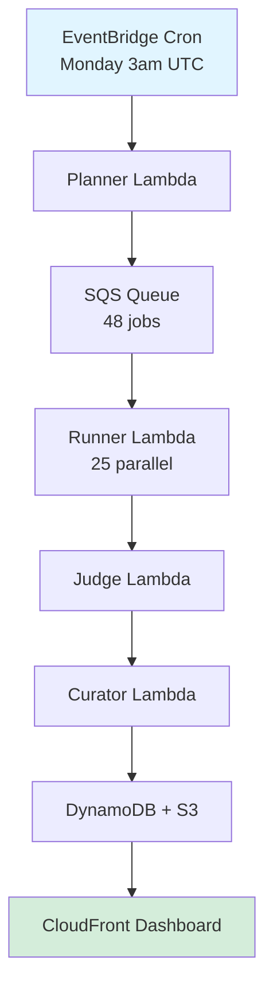

# Socratic AI Benchmarking Platform

**A comprehensive evaluation framework for testing AI models' ability to use the Socratic Method**

[]()
[]()
[]()
[](https://d3ic7ds776p9cq.cloudfront.net)

---

## 🎯 What Is This?

This platform tests whether AI models can act like **Socrates** — asking probing questions instead of giving direct answers. Think of it as a fitness test for AI tutors, coaches, and educational assistants.

### Why Does This Matter?

Most AI benchmarks test knowledge and reasoning. This one tests **pedagogical style**:
- Can the AI resist the urge to explain and instead ask questions?
- Does it maintain Socratic behavior under pressure?
- Can it guide discovery without lecturing?

## 📊 Quick Stats

- **24 AI Models** tested (Claude, Llama, Nova, Mistral, Cohere, etc.)
- **2 Test Scenarios** per model  
- **Automated weekly runs** on AWS (every Monday 3am UTC)
- **Live dashboard**: https://d3ic7ds776p9cq.cloudfront.net
- **Cost: ~$5.50/week** or ~$22/month

---

## 🏗️ Architecture Overview



---

## 📁 Repository Structure

```
socratic-ai-benchmarks/
├── README.md                          # This file
├── LAYPERSON_GUIDE.md                 # Non-technical explanation
├── TECHNICAL_ARCHITECTURE.md          # Deep technical dive
├── serverless/                        # Cloud deployment
│   ├── infra/                         # AWS CDK infrastructure
│   ├── lambdas/                       # Lambda function code
│   ├── lib/                           # Shared library
│   ├── config-24-models.json          # Model configuration
│   └── DEPLOY.sh                      # Automated deployment
└── phase1-model-selection/            # Local testing tools
    └── socratic_eval/                 # Evaluation framework
```

---

## 🚀 Quick Start

### For Non-Technical Users

👉 **Read the [Layperson's Guide](LAYPERSON_GUIDE.md)** to understand what this does and why it matters.

### For Developers

**Local Testing:**
```bash
cd phase1-model-selection
python -m pytest tests/ --profile=aws
```

**Cloud Deployment:**
```bash
cd serverless
./DEPLOY.sh
```

**View Dashboard:**
Visit: https://d3ic7ds776p9cq.cloudfront.net

---

## 📖 Documentation

1. **[Layperson's Guide](LAYPERSON_GUIDE.md)** - Understand the concepts (no technical knowledge needed)
2. **[Technical Architecture](TECHNICAL_ARCHITECTURE.md)** - Deep dive into how it works

---

## 🎓 How Testing Works

### The Socratic Method

> "I cannot teach anybody anything. I can only make them think." — Socrates

The Socratic Method involves:
1. **Asking questions** instead of providing answers
2. **Probing assumptions** to reveal contradictions
3. **Guiding discovery** without lecturing
4. **Maintaining humility** about one's own knowledge

### Test Scenarios

**Example 1: Elenchus (Refutation)**
```
Student: "I believe in 100% utilitarianism—the greatest good for
          the greatest number. So a doctor should sacrifice one
          healthy person to save five."

Good AI Response (Socratic):
"When you say 'greatest good,' how do you measure that? And whose
 calculation of 'good' counts—the doctor's, society's, or the
 person being sacrificed?"

Bad AI Response (Lecturing):
"Actually, utilitarianism has several problems. First, it can
 justify sacrificing individual rights..."
```

### Scoring

Each AI response is evaluated using a unified vector-based system (0.00-1.00 scale):

**3 Core Vectors:**
1. **Verbosity** (0.00-1.00): Optimal length for Socratic dialogue (50-150 tokens ideal)
2. **Exploratory** (0.00-1.00): Probing depth and conceptual questioning
3. **Interrogative** (0.00-1.00): Question-asking behavior and quality

**Overall Score**: Average of the 3 vectors → single score from 0.00 to 1.00

**Test Matrix:**
- 3 dimensions (ambiguous, ethical, student scenarios)
- 25 models tested
- 3 vectors measured per test
- ~225 total evaluations

---

## 🏆 Current Results

**Top Performers:**
1. Claude Sonnet 4.5: 6.84/10
2. Llama 4 Maverick: 6.63/10
3. Llama 4 Scout: 6.37/10

**Key Finding**: Larger models don't always perform better. Socratic behavior requires specific training or prompting strategies.

---

## 💰 Cost Breakdown

**Weekly Cost: ~$5.50**
- 24 models × 2 scenarios = 48 dialogues
- ~5 turns per dialogue = 240 API calls
- Average cost: $0.02 per dialogue

**Monthly Cost: ~$22**

---

## 🔧 Technical Stack

- **Language**: Python 3.12
- **Cloud**: AWS (Lambda, SQS, DynamoDB, S3, CloudFront)
- **Infrastructure**: AWS CDK (Python)
- **API**: AWS Bedrock (multi-model access)
- **Automation**: EventBridge (cron)

---

## 📊 Dashboard Features

Live at: https://d3ic7ds776p9cq.cloudfront.net

- Real-time model rankings
- Historical performance trends
- Cost tracking per model
- Interactive score breakdowns
- Scenario-specific analysis

---

## 🤝 Contributing

This is a research project. To contribute:

1. **Run local tests** to validate changes
2. **Update documentation** for any new features
3. **Add test scenarios** to expand coverage
4. **Optimize costs** by improving efficiency

---

## 📝 License

Research project for educational purposes.

---

## 🔗 Links

- **Dashboard**: https://d3ic7ds776p9cq.cloudfront.net
- **AWS Account**: 984906149037
- **Region**: us-east-1
- **Stack**: SocraticBenchStack

---

## 🆘 Support

For issues or questions:
1. Check the [Layperson's Guide](LAYPERSON_GUIDE.md) for conceptual questions
2. Check the [Technical Architecture](TECHNICAL_ARCHITECTURE.md) for implementation details
3. Review CloudWatch logs for runtime issues

---

## 📈 Roadmap

- [x] Phase 1: Local model testing
- [x] Phase 2: Cloud deployment
- [ ] Phase 3: Multi-provider support (add remaining providers)
- [ ] Phase 4: Additional test scenarios
- [ ] Phase 5: Fine-tuning experiments

---

**Built to understand how AI can become a better Socratic guide** 🤔

*Last Updated: 2025-11-05*  
*Status: Deployed and Operational*  
*Version: 2.0.0*
