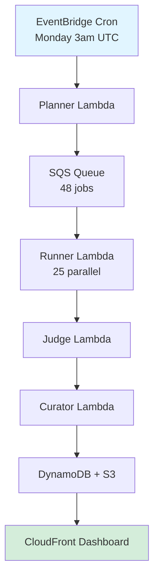

# Socratic AI Benchmarking Platform

**A comprehensive evaluation framework for testing AI models' ability to use the Socratic Method**

[]()
[]()
[]()
[](https://d3ic7ds776p9cq.cloudfront.net)

---

## 🎯 What Is This?

This platform tests whether AI models can act like **Socrates** — asking probing questions instead of giving direct answers. Think of it as a fitness test for AI tutors, coaches, and educational assistants.

### Why Does This Matter?

Most AI benchmarks test knowledge and reasoning. This one tests **pedagogical style**:
- Can the AI resist the urge to explain and instead ask questions?
- Does it maintain Socratic behavior under pressure?
- Can it guide discovery without lecturing?

## 📊 Quick Stats

- **24 AI Models** tested (Claude, Llama, Nova, Mistral, Cohere, etc.)
- **2 Test Scenarios** per model
- **Automated weekly runs** on AWS (every Monday 3am UTC)
- **Live dashboard**: https://d3ic7ds776p9cq.cloudfront.net
- **Cost: ~$5.50/week** or ~$22/month

---

## 🏗️ Architecture Overview



---

## 📁 Repository Structure

```
socratic-ai-benchmarks/
├── README.md                          # This file
├── LAYPERSON_GUIDE.md                 # Non-technical explanation
├── TECHNICAL_ARCHITECTURE.md          # Deep technical dive
├── serverless/                        # Cloud deployment
│   ├── infra/                         # AWS CDK infrastructure
│   ├── lambdas/                       # Lambda function code
│   ├── lib/                           # Shared library
│   ├── config-24-models.json          # Model configuration
│   └── DEPLOY.sh                      # Automated deployment
└── phase1-model-selection/            # Local testing tools
    └── socratic_eval/                 # Evaluation framework
```

---

## 🚀 Quick Start

### For Non-Technical Users

👉 **Read the [Layperson's Guide](LAYPERSON_GUIDE.md)** to understand what this does and why it matters.

### For Developers

**Local Testing:**

```bash
# 1) Configure AWS + Bedrock
export AWS_REGION=us-east-1
# optional: assume role for Bedrock if cross-account
# export BEDROCK_ASSUME_ROLE_ARN=arn:aws:iam::<acct>:role/BedrockInvokeRole

# 2) Pick a Bedrock modelId from our registry (examples below)
export BEDROCK_MODEL_IDS='[
  "anthropic.claude-3-5-sonnet-20241022-v1:0",
  "meta.llama3-1-70b-instruct-v1:0",
  "mistral.mistral-large-2407-v1:0",
  "amazon.titan-text-premier-v1:0"
]'

# 3) Run locally via Docker (CLI mode)
docker build -t socratic-runner .
docker run --rm \
  -e AWS_REGION \
  -e BEDROCK_MODEL_IDS \
  socratic-runner \
  --model anthropic.claude-3-5-sonnet-20241022-v1:0 \
  --prompt "I'm considering a career change but unsure where to start."
```

The runner will:
1. Load the Socratic system prompt
2. Invoke the model **via Amazon Bedrock**
3. Write raw turns and judge results to S3 (if configured)
4. Print a compact JSON summary (run_id, model, n_turns)

---

## Weekly Serverless Flow

For production weekly runs, the system operates as follows:

```
EventBridge (weekly cron)
    ↓
Planner Lambda
    ↓
SQS dialogue-jobs
    ↓
Runner Lambda (parallel, max 25 concurrent)
    ↓
SQS judge-jobs
    ↓
Judge Lambda (parallel, max 25 concurrent)
    ↓
EventBridge run.judged event
    ↓
Curator Lambda
    ↓
DynamoDB + S3 (curated JSON)
    ↓
API Gateway + Read Lambda
    ↓
Static UI (S3 + CloudFront)
```

All model requests in this flow go through **Amazon Bedrock**.

**Cost**: ~$2/week, ~$8/month

---

## Configuration (Environment Variables)

| Variable | Required | Description | Example |
|----------|----------|-------------|---------|
| `AWS_REGION` | Yes | AWS region for Bedrock | `us-east-1` |
| `BEDROCK_MODEL_IDS` | Yes | JSON array of model IDs | See quickstart above |
| `BEDROCK_ASSUME_ROLE_ARN` | No | Cross-account role ARN | `arn:aws:iam::123:role/BedrockInvokeRole` |
| `RUNNER_DEFAULT_TURNS` | No | Max turns per dialogue | `40` (default) |
| `RUNNER_S3_BUCKET` | No | S3 bucket for artifacts | `socratic-benchmark-data` |

---

## Example Bedrock Model IDs

```json
[
  "anthropic.claude-3-5-sonnet-20241022-v1:0",
  "anthropic.claude-3-opus-20240229-v1:0",
  "anthropic.claude-3-5-haiku-20241022-v1:0",
  "meta.llama3-1-70b-instruct-v1:0",
  "meta.llama3-1-8b-instruct-v1:0",
  "mistral.mistral-large-2407-v1:0",
  "amazon.titan-text-premier-v1:0"
]
```

See [docs/bedrock.md](docs/bedrock.md) for the complete list and how to add/remove models.

---

## Architecture

Phase 1 uses a serverless, Lambda-based architecture:

- **Data Layer**: DynamoDB (on-demand) + S3 (raw + curated)
- **Services Layer**: All Lambda functions
- **Note**: No containers in production yet; Docker used for local runs and (later) Batch

See [docs/architecture.md](docs/architecture.md) for detailed architecture documentation.

---

## Benchmark Details

The Socratic Disposition Benchmark (SDB) evaluates each turn on three dimensions:

- **Form** (0–3): Ends with a question, one question only, no advice
- **Substance** (0–3): Probes definition/assumption/evidence/implication/alternative
- **Purity** (0–4): Non-leading, no embedded answers
- **Total Score**: 0–10 per turn
- **Half-life**: First turn scoring < 8
- **Judge**: Single trusted model via Bedrock; heuristics as pre-filter

See [docs/benchmark.md](docs/benchmark.md) for the complete rubric and scoring methodology.

---

## Documentation

- **[README.md](README.md)** (this file) – Quick start and overview
- **[docs/architecture.md](docs/architecture.md)** – System architecture and data flow
- **[docs/runner.md](docs/runner.md)** – Docker CLI contract and usage
- **[docs/bedrock.md](docs/bedrock.md)** – Bedrock routing and model configuration
- **[docs/benchmark.md](docs/benchmark.md)** – Socratic Disposition rubric and metrics
- **[CONTRIBUTING.md](CONTRIBUTING.md)** – How to contribute
- **[CHANGELOG.md](CHANGELOG.md)** – Version history

---

## Repository Structure

```
socratic-ai-benchmarks/
├── README.md                       # This file
├── CHANGELOG.md                    # Version history
├── CONTRIBUTING.md                 # Contribution guide
├── Makefile                        # Docs validation targets
│
├── docs/                           # Documentation
│   ├── architecture.md             # System architecture
│   ├── runner.md                   # Docker CLI docs
│   ├── bedrock.md                  # Bedrock routing
│   └── benchmark.md                # SDB rubric
│
├── phase1-model-selection/         # Phase 1: CLI model comparison
│   ├── socratic_eval/
│   │   ├── context_growth/         # Context growth framework
│   │   ├── vectors.py              # Three-vector evaluation
│   │   └── grader.py               # LLM-as-judge utilities
│   ├── benchmark.py
│   └── README.md
│
├── serverless/                     # Phase 2: Serverless benchmarking MVP
│   ├── infra/                      # Python CDK infrastructure
│   ├── lambdas/                    # 5 Lambda functions
│   ├── lib/                        # Shared socratic_bench library
│   ├── ui/                         # Static dashboard
│   ├── scripts/                    # Deployment helpers
│   └── README.md
│
├── infrastructure/                 # Infrastructure as code
├── lambdas/                        # Lambda function implementations
│
└── archive/                        # Superseded implementations
    ├── infrastructure-typescript/  # Old TypeScript CDK (don't use)
    ├── lambdas-old/                # Old stubs (don't use)
    └── phase3-batch-architecture/  # Future design docs
```

---

## Next Steps

### For Local Testing (CLI)

1. Configure AWS credentials and Bedrock access
2. Build the Docker image: `docker build -t socratic-runner .`
3. Run a test dialogue (see [Quickstart](#quickstart-cli))
4. Review output in console and S3

### For Weekly Production Runs (Serverless)

1. Deploy serverless stack: `cd serverless/infra && cdk deploy`
2. Upload config: `aws s3 cp config.json s3://$BUCKET_NAME/artifacts/config.json`
3. Trigger test run: `aws lambda invoke --function-name SocraticBenchStack-PlannerFunction response.json`
4. Monitor via CloudWatch Logs
5. View results in DynamoDB/S3 or via the dashboard

See [docs/runner.md](docs/runner.md) and [serverless/DEPLOYMENT_GUIDE.md](serverless/DEPLOYMENT_GUIDE.md) for detailed instructions.

---

## Three-Phase Vision

This repository supports a broader three-phase research project:

- **Phase 1** (current): Socratic Disposition Benchmark via Bedrock
- **Phase 2** (MVP ready): Serverless weekly benchmarking for continuous evaluation
- **Phase 3** (future): Production research study with 120-240 students

See [serverless/README.md](serverless/README.md) for Phase 2 details and [VISION.md](VISION.md) (if available) for the complete roadmap.

---

## Roadmap

Future enhancements may include:
- Advanced CSD (Content-Specific Dimensions) scoring
- Secondary judge validation
- AWS Batch integration for larger runs
- Enhanced UI with authentication
- Multi-turn conversation-level metrics
- Production research platform (Phase 3)

---

## Key Principles

1. **Bedrock-First**: All LLM requests via Amazon Bedrock (no direct provider SDKs)
2. **CLI-First, Lambda-Second**: Test locally before deploying serverless
3. **Phased Delivery**: Build incrementally, validate before scaling
4. **Simplest Thing That Works**: Lambda + SQS for MVP, not Step Functions + Batch
5. **Reproducibility First**: Deterministic manifests, versioned configs, immutable data
6. **Observable by Default**: CloudWatch logs, X-Ray tracing, metrics
7. **Cost-Conscious**: Free tiers, pay-per-use, archive to cold storage

---

## Prerequisites

### Phase 1 (Current)
- Python 3.9+
- Docker
- AWS CLI configured
- AWS Bedrock access (Claude, Llama, Mistral models)

### Phase 2 (Serverless)
- Python 3.12+
- Node.js 20+ (for CDK)
- AWS CDK CLI (`npm install -g aws-cdk`)
- AWS Account with Lambda, DynamoDB, S3, Bedrock access

---

## Cost Estimates

### Phase 1: CLI Testing
- **Single run** (1 model, 5 turns): ~$0.10
- **Model comparison** (8 models, 120 scenarios): ~$10

### Phase 2: Serverless Benchmarking
- **Weekly run** (2 models, 6 scenarios): ~$2
- **Monthly total**: ~$8
- **Annual**: ~$100
- **Idle cost**: ~$0.35/month (storage only)

---

## Contributing

This is a research project. Contributions are welcome!

See [CONTRIBUTING.md](CONTRIBUTING.md) for:
- How to run CLI tests
- How to propose model list changes
- Bug reporting guidelines
- Feature request process

**Code style**: Black, isort, mypy

---

## License

Research code and methodology. License TBD pending publication.

---

## Contact

**Project**: Socratic AI Institute
**Repository**: [socratic-ai-benchmarks](https://github.com/socratic-ai-institute/socratic-ai-benchmarks)
**AWS Profile**: `mvp`
**Region**: `us-east-1`
**Phase**: 1 (Socratic Disposition Benchmark)
**Status**: CLI-ready, serverless deployment available

---

*Last Updated: 2025-11-05*
*Phase: 1 – Bedrock-Only Socratic Disposition Benchmark*
*Version: 1.1.0*
