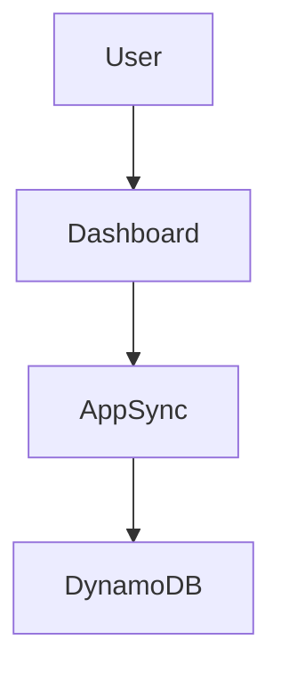

# Socratic AI Benchmarks Dashboard - Documentation Index

Complete documentation suite for the research dashboard monitoring a 24-condition educational study.

---

## Quick Links

| Document | Purpose | Audience |
|----------|---------|----------|
| **[DASHBOARD_SUMMARY.md](DASHBOARD_SUMMARY.md)** | Executive overview | All stakeholders |
| **[DASHBOARD_ARCHITECTURE.md](DASHBOARD_ARCHITECTURE.md)** | Complete technical design | Developers, Tech leads |
| **[COMPONENT_DIAGRAM.md](COMPONENT_DIAGRAM.md)** | Visual architecture & data flows | Developers |
| **[DEPLOYMENT_GUIDE.md](DEPLOYMENT_GUIDE.md)** | Step-by-step deployment | DevOps, Sysadmins |
| **[API_REFERENCE.md](API_REFERENCE.md)** | API documentation | Frontend devs, Integrators |
| **[README.md](README.md)** | Study design overview | Research team |

---

## Document Overview

### 1. DASHBOARD_SUMMARY.md
**Executive Summary - Start Here**

- What the dashboard does
- Key features and capabilities
- User roles and permissions
- Cost estimates
- Success metrics
- FAQ

**Best for**: Research team members, PIs, administrators who need high-level understanding

**Length**: 15-minute read

---

### 2. DASHBOARD_ARCHITECTURE.md
**Complete Technical Architecture**

**Contents**:
- Dashboard features (real-time monitoring, visualizations, exports)
- Technology stack decisions (React, AppSync, DynamoDB)
- Amplify integration (hosting, CI/CD, domain setup)
- API design (GraphQL schema, authentication, authorization)
- Component architecture (hierarchy, state management)
- Performance optimization (caching, lazy loading, virtualization)
- Security considerations (FERPA compliance, encryption, audit logging)
- Cost breakdown (development vs. production)
- Testing strategy (unit, integration, E2E)
- Wireframes and visual designs

**Best for**: Senior developers, architects, technical decision-makers

**Length**: 1-hour deep dive

**Key Sections**:
- Section 2: Technology Stack → Understand why React/AppSync/DynamoDB
- Section 4: API Integration → GraphQL schema and authentication
- Section 5: Component Architecture → How the app is structured
- Section 9: Wireframes → Visual mockups of dashboard views

---

### 3. COMPONENT_DIAGRAM.md
**Visual Architecture & Data Flow**

**Contents**:
- System architecture overview (high-level diagram)
- Frontend component hierarchy (full tree structure)
- Data flow patterns (query, mutation, subscription, error handling)
- State management architecture (React Query + Zustand)
- API request/response flows (examples with real data)
- Performance optimization strategies (code splitting, caching)

**Best for**: Frontend developers, new team members learning the codebase

**Length**: 30-minute visual guide

**Key Diagrams**:
- System Architecture Overview → See how all AWS services connect
- Component Hierarchy → Navigate the React component tree
- Query Flow → Understand data fetching from user click to UI update
- Subscription Flow → See how real-time updates work

---

### 4. DEPLOYMENT_GUIDE.md
**Step-by-Step Deployment Instructions**

**Contents**:
- Prerequisites (AWS account, CLI tools)
- Part 1: Infrastructure deployment (CDK)
- Part 2: Frontend setup (React + Amplify)
- Part 3: Amplify hosting deployment
- Part 4: Custom domain setup
- Part 5: User management (Cognito)
- Part 6: Monitoring & logging (CloudWatch, X-Ray)
- Part 7: Backup & disaster recovery
- Part 8: Performance tuning (DynamoDB, Lambda, caching)
- Part 9: Security hardening (WAF, secrets management, audit logging)
- Part 10: Troubleshooting (common issues and solutions)
- Part 11: Production checklist
- Part 12: Rollback procedures

**Best for**: DevOps engineers, system administrators, deployment engineers

**Length**: Reference guide (use as needed)

**Quick Start**: Part 1-3 (infrastructure + frontend + hosting) = 30 minutes

**Most Important Sections**:
- Part 1: Infrastructure Deployment → Deploy AWS resources
- Part 3: Amplify Hosting → Deploy frontend to production
- Part 5: User Management → Create researcher accounts
- Part 10: Troubleshooting → Fix common deployment issues

---

### 5. API_REFERENCE.md
**Complete API Documentation**

**Contents**:
- All GraphQL queries (listSessions, getSession, aggregateMetrics, etc.)
- All mutations (updateSession, flagAnomaly, requestExport)
- All subscriptions (onSessionUpdate, onNewSession)
- Type definitions (enums, inputs, outputs)
- Real examples with variables and responses
- Error handling (error types, rate limits)
- Pagination patterns
- Code generation setup

**Best for**: Frontend developers, API consumers, integration developers

**Length**: Quick reference (search as needed)

**Most Used Sections**:
- Queries → Get data from backend
- Subscriptions → Real-time updates
- Examples → Copy-paste working queries
- Error Handling → Debug API issues

---

### 6. README.md
**Study Design Overview**

**Contents**:
- Experimental design (24 conditions explained)
- Independent variables (location, interval, intervention type)
- Student profile system
- Socratic question generation (AI prompts)
- Content delivery (Richmond history, 10-minute segments)
- Location-aware interventions
- Data collection schema

**Best for**: Research team, study designers, content creators

**Length**: 15-minute read

**Key Sections**:
- Study Design Summary → Understand the 24 conditions
- Student Profile System → How student data is captured
- Socratic Question Generator → How AI creates questions
- Location-Aware Prompts → How questions adapt to location

---

## Use Cases & Recommended Reading Paths

### Use Case 1: "I'm a researcher, how do I use the dashboard?"

**Read**:
1. [DASHBOARD_SUMMARY.md](DASHBOARD_SUMMARY.md) → Overview and features (15 min)
2. User Guide (to be created) → Step-by-step usage instructions
3. [API_REFERENCE.md](API_REFERENCE.md) → Examples section (if using API directly)

**Skip**:
- DASHBOARD_ARCHITECTURE.md (too technical)
- COMPONENT_DIAGRAM.md (implementation details)
- DEPLOYMENT_GUIDE.md (not relevant for end users)

---

### Use Case 2: "I'm a developer building the dashboard"

**Read**:
1. [DASHBOARD_ARCHITECTURE.md](DASHBOARD_ARCHITECTURE.md) → Full technical design (1 hour)
2. [COMPONENT_DIAGRAM.md](COMPONENT_DIAGRAM.md) → Visual architecture (30 min)
3. [API_REFERENCE.md](API_REFERENCE.md) → API contracts (reference)
4. [DEPLOYMENT_GUIDE.md](DEPLOYMENT_GUIDE.md) → Parts 1-3 (deployment basics)

**Focus Areas**:
- Technology Stack (Section 2 of Architecture doc)
- Component Architecture (Section 5 of Architecture doc)
- Data Flow Patterns (Component Diagram doc)
- Code Generation (API Reference doc)

---

### Use Case 3: "I'm deploying the dashboard to AWS"

**Read**:
1. [DEPLOYMENT_GUIDE.md](DEPLOYMENT_GUIDE.md) → All parts (reference guide)
2. [DASHBOARD_ARCHITECTURE.md](DASHBOARD_ARCHITECTURE.md) → Section 3 (Amplify Integration)
3. [DASHBOARD_SUMMARY.md](DASHBOARD_SUMMARY.md) → Cost Breakdown section

**Follow**:
- Part 1: Infrastructure Deployment (CDK)
- Part 2: Frontend Setup (React + Amplify)
- Part 3: Amplify Hosting Deployment
- Part 11: Production Checklist (before going live)

---

### Use Case 4: "I need to integrate with the dashboard API"

**Read**:
1. [API_REFERENCE.md](API_REFERENCE.md) → Full API documentation
2. [DASHBOARD_ARCHITECTURE.md](DASHBOARD_ARCHITECTURE.md) → Section 4.1 (GraphQL Schema)
3. [COMPONENT_DIAGRAM.md](COMPONENT_DIAGRAM.md) → API Request/Response Flows

**Key Sections**:
- Queries → Get data
- Mutations → Modify data
- Subscriptions → Real-time updates
- Examples → Working code samples
- Code Generation → Auto-generate TypeScript types

---

### Use Case 5: "I'm troubleshooting a production issue"

**Read**:
1. [DEPLOYMENT_GUIDE.md](DEPLOYMENT_GUIDE.md) → Part 10 (Troubleshooting)
2. [DASHBOARD_ARCHITECTURE.md](DASHBOARD_ARCHITECTURE.md) → Section 6 (Monitoring & Logging)
3. [API_REFERENCE.md](API_REFERENCE.md) → Error Handling section

**Common Issues**:
- "Unauthorized" errors → Deployment Guide Part 10, Issue 1
- Build failures → Deployment Guide Part 10, Issue 2
- Queries return null → Deployment Guide Part 10, Issue 3
- Real-time updates not working → Deployment Guide Part 10, Issue 4

---

### Use Case 6: "I'm designing the study"

**Read**:
1. [README.md](README.md) → Study design overview (15 min)
2. [DASHBOARD_SUMMARY.md](DASHBOARD_SUMMARY.md) → Data visualization features
3. [API_REFERENCE.md](API_REFERENCE.md) → Export capabilities (for data analysis)

**Focus Areas**:
- Experimental design (24 conditions)
- Location-aware interventions
- Socratic question generation
- Data collection schema
- Export formats for statistical analysis

---

## Document Maintenance

### Version Control

All documentation is version-controlled in Git alongside code.

**Branches**:
- `main`: Production documentation (reflects live system)
- `develop`: Work-in-progress documentation
- Feature branches: Document new features before implementation

**Versioning**:
- Major version (v2.0.0): Breaking changes (API redesign)
- Minor version (v1.1.0): New features (added endpoints)
- Patch version (v1.0.1): Corrections, clarifications

### Update Process

**When to update documentation**:

| Event | Documents to Update |
|-------|---------------------|
| New feature added | Architecture, Component Diagram, API Reference |
| Deployment process changed | Deployment Guide |
| API endpoint changed | API Reference, Architecture (Section 4) |
| UI redesign | Architecture (Section 9: Wireframes) |
| Performance optimization | Component Diagram (Performance section) |
| Cost changes | Dashboard Summary (Cost Breakdown) |
| Security update | Deployment Guide (Part 9), Architecture (Section 14) |

**Review Schedule**:
- Weekly: Check for outdated sections
- Monthly: Full documentation review
- Quarterly: Architecture decision review (ADR)

---

## Contributing to Documentation

### Style Guide

**Writing Style**:
- Clear, concise, technical language
- Active voice ("Deploy the stack" not "The stack should be deployed")
- Present tense ("The dashboard shows" not "The dashboard will show")
- Avoid jargon (or define it on first use)

**Code Examples**:
- Always include complete, runnable examples
- Add comments for non-obvious parts
- Use realistic variable names (not `foo`, `bar`)
- Show expected output

**Diagrams**:
- ASCII art for simple diagrams (easy to version control)
- Mermaid.js for complex diagrams (renders in GitHub)
- Screenshots only when necessary (hard to update)

### Templates

**New Feature Documentation Template**:
```markdown
## Feature Name

**Purpose**: One-sentence description

**User Story**: As a [role], I want [capability] so that [benefit]

**Usage**:
```typescript
// Code example
```

**API Changes**:
- New endpoint: `query { newFeature }`
- Modified types: `Session` now includes `newField`

**Deployment Notes**:
- Migration required: Yes/No
- Breaking change: Yes/No
- Rollback safe: Yes/No
```

### Submitting Documentation Changes

```bash
# 1. Create feature branch
git checkout -b docs/update-api-reference

# 2. Make changes
vim API_REFERENCE.md

# 3. Commit with clear message
git commit -m "docs: Add exportToParquet mutation to API reference"

# 4. Push and create PR
git push origin docs/update-api-reference
# Open PR on GitHub
```

**PR Review Checklist**:
- [ ] Accuracy: Technical details correct?
- [ ] Completeness: All sections updated?
- [ ] Clarity: Easy to understand?
- [ ] Examples: Code samples work?
- [ ] Links: All internal links valid?
- [ ] Formatting: Markdown renders correctly?

---

## Documentation Tools

### Viewing Documentation

**Recommended Tools**:
- **VS Code**: Markdown preview (Cmd+Shift+V)
- **GitHub**: Renders markdown automatically
- **MkDocs**: Generate static site (optional)

**VS Code Extensions**:
- Markdown All in One
- Markdown Preview Enhanced
- Code Spell Checker

### Generating Diagrams

**Mermaid.js** (in Markdown):


**ASCII Art** (for simple flows):
```
User → Dashboard → AppSync → DynamoDB
```

**Excalidraw** (for complex diagrams):
1. Draw at https://excalidraw.com
2. Export as SVG
3. Commit to `docs/images/`
4. Reference: ``

---

## Additional Resources

### External Documentation

**AWS Services**:
- Amplify: https://docs.amplify.aws
- AppSync: https://docs.aws.amazon.com/appsync
- DynamoDB: https://docs.aws.amazon.com/dynamodb
- Cognito: https://docs.aws.amazon.com/cognito
- CDK: https://docs.aws.amazon.com/cdk

**Frontend Libraries**:
- React: https://react.dev
- React Query: https://tanstack.com/query
- Vite: https://vitejs.dev
- Tailwind CSS: https://tailwindcss.com

**Best Practices**:
- GraphQL: https://graphql.org/learn/best-practices
- AWS Well-Architected: https://aws.amazon.com/architecture/well-architected

### Community & Support

**Internal**:
- Slack: #socratic-dashboard
- Wiki: https://wiki.university.edu/socratic
- Email: dashboard-support@university.edu

**External**:
- GitHub Issues: https://github.com/your-org/socratic-dashboard/issues
- Stack Overflow: Tag `socratic-dashboard`

---

## Document Change Log

| Date | Document | Change | Author |
|------|----------|--------|--------|
| 2025-10-23 | All | Initial creation | Frontend Architect |
| TBD | API_REFERENCE.md | Add v1.1 endpoints | Backend Team |
| TBD | DEPLOYMENT_GUIDE.md | Add Kubernetes option | DevOps |

---

## Feedback

**Have suggestions for documentation?**

- Open GitHub issue: https://github.com/your-org/socratic-dashboard/issues/new
- Tag: `documentation`
- Template: [Documentation Improvement]

**Documentation bugs?**

Report:
- Broken links
- Outdated information
- Confusing sections
- Missing examples

---

## Quick Command Reference

**Build Documentation Site** (optional):
```bash
mkdocs build
mkdocs serve  # View at http://localhost:8000
```

**Generate PDF** (for offline reading):
```bash
pandoc DASHBOARD_SUMMARY.md -o dashboard-summary.pdf
```

**Search All Docs**:
```bash
grep -r "searchterm" *.md
```

**Count Total Words**:
```bash
wc -w *.md
# ~50,000 words across all docs
```

---

## License

Documentation licensed under MIT License (same as code).

---

**Last Updated**: 2025-10-23
**Documentation Version**: 1.0.0
**Software Version**: Pre-release (not yet deployed)
