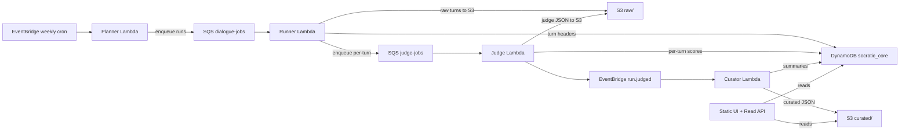

# Architecture Documentation

This document describes the Phase 1 serverless architecture for the Socratic Disposition Benchmark (SDB).

---

## Overview

Phase 1 is designed as a fully serverless, Lambda-based system that runs weekly benchmarks of LLM models' Socratic dialogue capabilities. **All model requests go through Amazon Bedrock** — no direct provider SDKs are used.

---

## High-Level Architecture



### ASCII Diagram (for terminals)

```
┌─────────────────────┐
│ EventBridge (cron)  │
│  Weekly: Mon 3 AM   │
└──────────┬──────────┘
           ↓
┌──────────────────────┐
│  Planner Lambda      │
│  - Read config S3    │
│  - Generate manifest │
│  - Enqueue jobs      │
└──────────┬───────────┘
           ↓
┌──────────────────────┐
│ SQS: dialogue-jobs   │
│  Fan-out (parallel)  │
└──────────┬───────────┘
           ↓
┌──────────────────────┐
│  Runner Lambda       │
│  - LangChain         │
│  - Bedrock API       │
│  - Write S3 + DDB    │
└──────────┬───────────┘
           ↓
┌──────────────────────┐
│  SQS: judge-jobs     │
│  Per-turn scoring    │
└──────────┬───────────┘
           ↓
┌──────────────────────┐
│  Judge Lambda        │
│  - Heuristics        │
│  - Bedrock API       │
│  - Write scores      │
└──────────┬───────────┘
           ↓
┌──────────────────────┐
│ EventBridge:         │
│   run.judged event   │
└──────────┬───────────┘
           ↓
┌──────────────────────┐
│  Curator Lambda      │
│  - Aggregate metrics │
│  - Materialize JSON  │
└──────────┬───────────┘
           ↓
┌──────────────────────┐
│ DynamoDB + S3        │
│  Final results       │
└──────────────────────┘
           ↓
┌──────────────────────┐
│  API + Static UI     │
│  Read-only access    │
└──────────────────────┘
```

---

## Data Layer

### DynamoDB

**Table**: `socratic_core` (single-table design)

- **Capacity**: On-demand (auto-scaling)
- **Primary Key**: `PK` (partition key), `SK` (sort key)
- **GSI1**: Query by model (`GSI1PK`, `GSI1SK`)
- **GSI2**: Query by manifest (`GSI2PK`, `GSI2SK`)

**Item Types**:

| PK | SK | Type | Purpose |
|----|----|------|---------|
| `MANIFEST#M-{id}` | `META` | Manifest | Frozen config snapshot |
| `RUN#{run_id}` | `META` | Run | Model, scenario, status, timestamps |
| `RUN#{run_id}` | `TURN#{n}` | Turn | S3 pointer, tokens, latency |
| `RUN#{run_id}` | `JUDGE#{n}` | Judge | Overall score, heuristics, S3 pointer |
| `RUN#{run_id}` | `SUMMARY` | Summary | Aggregated metrics |
| `WEEK#{yyyy-Www}#MODEL#{model}` | `SUMMARY` | Weekly | Per-model weekly stats |

**Indexes**:
- **GSI1**: Query all runs for a given model
- **GSI2**: Query all runs for a given manifest (weekly batch)

### S3

**Bucket**: `socratic-benchmark-data` (or configured via `RUNNER_S3_BUCKET`)

**Structure**:

```
s3://socratic-benchmark-data/
├── manifests/
│   └── {manifest_id}.json          # Frozen config for weekly run
│
├── raw/
│   └── runs/
│       └── {run_id}/
│           ├── turn_000.json       # Full turn (student, AI, tokens)
│           ├── turn_001.json
│           ├── judge_000.json      # Full scores + evidence
│           └── judge_001.json
│
└── curated/
    ├── runs/
    │   └── {run_id}.json           # Compact summary
    │
    └── weekly/
        └── {week}/
            └── {model}.json        # Weekly aggregate per model
```

**Lifecycle**:
- `raw/` → Glacier after 90 days (optional)
- `curated/` → Stays hot indefinitely

---

## Services Layer

All services run on **AWS Lambda** (no containers in production for Phase 1).

### Planner Lambda

**Trigger**: EventBridge rule (weekly cron: Monday 3 AM UTC)

**Function**:
1. Read config from S3 (`config/benchmark-config.json`)
2. Generate deterministic manifest ID (content hash)
3. Write manifest to S3 + DynamoDB
4. Enqueue dialogue jobs (one per model × scenario)
5. Idempotent: manifest ID prevents duplicate runs

**Environment**:
- `CONFIG_S3_BUCKET`
- `CONFIG_S3_KEY`
- `SQS_DIALOGUE_QUEUE_URL`

### Runner Lambda

**Trigger**: SQS queue (`dialogue-jobs`)

**Function**:
1. Load scenario + model config
2. Call `run_dialogue()` from shared `socratic_bench` library
3. For each turn:
   - Write turn bundle to S3 (`raw/runs/{run_id}/turn_NNN.json`)
   - Write TURN item to DynamoDB
   - Enqueue judge job to SQS
4. Write RUN#META to DynamoDB (status: `completed`)

**Concurrency**: Max 25 parallel executions (reserved concurrency)

**Timeout**: 15 minutes

**Environment**:
- `AWS_REGION`
- `BEDROCK_MODEL_IDS`
- `RUNNER_S3_BUCKET`
- `RUNNER_DEFAULT_TURNS`
- `SQS_JUDGE_QUEUE_URL`
- `DYNAMODB_TABLE_NAME`

### Judge Lambda

**Trigger**: SQS queue (`judge-jobs`)

**Function**:
1. Load turn bundle from S3
2. Compute heuristics (has question, open-ended, etc.)
3. Call LLM-as-judge via Bedrock (Claude 3.5 Sonnet v2)
4. Write JUDGE item to DynamoDB + full JSON to S3
5. If all turns judged → emit `run.judged` event to EventBridge

**Concurrency**: Max 25 parallel executions

**Timeout**: 5 minutes

**Environment**:
- `AWS_REGION`
- `BEDROCK_JUDGE_MODEL_ID`
- `RUNNER_S3_BUCKET`
- `DYNAMODB_TABLE_NAME`
- `EVENTBRIDGE_BUS_NAME`

### Curator Lambda

**Trigger**: EventBridge custom event (`run.judged`)

**Function**:
1. Load all TURNs + JUDGEs for run from DynamoDB
2. Compute aggregated metrics:
   - Overall score (mean of all turns)
   - Compliance rate (% of turns ≥ 3.0)
   - Half-life (first turn < 3.0)
   - Violation rates (form/substance/purity)
3. Write RUN#SUMMARY to DynamoDB
4. Materialize compact JSON to S3 (`curated/runs/{run_id}.json`)
5. Update weekly aggregate (`WEEK#{week}#MODEL#{model}#SUMMARY`)

**Concurrency**: Default (10)

**Timeout**: 5 minutes

**Environment**:
- `RUNNER_S3_BUCKET`
- `DYNAMODB_TABLE_NAME`

### Read API Lambda

**Trigger**: API Gateway (REST API)

**Function**: Serve data to UI and external clients

**Routes**:
- `GET /weekly?week=YYYY-WW` → Weekly stats
- `GET /runs/{run_id}/summary` → Run summary
- `GET /runs/{run_id}/turns` → Turn headers (paginated)

**Auth**: API key (header: `x-api-key`)

**Environment**:
- `RUNNER_S3_BUCKET`
- `DYNAMODB_TABLE_NAME`

---

## Bedrock Routing

**Key Principle**: All LLM invocations go through Amazon Bedrock. No direct provider SDKs.

### API Calls Used

1. **Converse API** (`bedrock-runtime:Converse`)
   - Used for dialogue generation (Runner Lambda)
   - Supports streaming and multi-turn conversations
   - Model-agnostic interface

2. **Invoke API** (`bedrock-runtime:InvokeModel`)
   - Used for judge scoring (Judge Lambda)
   - Accepts model-specific payloads
   - Used with Claude 3.5 Sonnet v2 as trusted judge

### Retry and Backoff

- **Throttling**: Exponential backoff with jitter (2s, 4s, 8s, 16s)
- **Retries**: Up to 4 attempts for network errors
- **Timeout**: 60s per API call

### Regions

- **Primary**: `us-east-1` (default)
- **Fallback**: `us-west-2` (if configured)

See [docs/bedrock.md](bedrock.md) for detailed routing configuration and model registry.

---

## Local vs. Production

### Local (CLI)

For local testing and development:

- **Docker image** with CLI entry point
- Same `socratic_bench` library used by Lambdas
- Writes to S3 if `RUNNER_S3_BUCKET` is set
- Prints JSON summary to stdout

**Usage**:
```bash
docker run --rm \
  -e AWS_REGION=us-east-1 \
  -e BEDROCK_MODEL_IDS='[...]' \
  socratic-runner \
  --model anthropic.claude-3-5-sonnet-20241022-v1:0 \
  --prompt "Your seed prompt here"
```

### Production (Lambda)

For weekly automated runs:

- **EventBridge** triggers Planner Lambda
- **SQS** fan-out for parallel execution
- **Lambda** functions process dialogues and judging
- **DynamoDB + S3** for durable storage
- **API + UI** for viewing results

**Deployment**:
```bash
cd serverless
./scripts/deploy.sh
```

---

## Cost Breakdown

**Weekly run** (2 models × 6 scenarios = 12 runs × 5 turns = 60 turns):

| Component | Cost/Week | Cost/Month |
|-----------|-----------|------------|
| Lambda (Compute) | $0.92 | $3.68 |
| Bedrock (Dialogue) | $0.50 | $2.00 |
| Bedrock (Judge) | $0.30 | $1.20 |
| DynamoDB | $0.03 | $0.10 |
| S3 + CloudFront | $0.05 | $0.20 |
| **Total** | **~$2** | **~$8** |

**Idle cost** (no runs): ~$0.35/month (DynamoDB + S3 storage only)

---

## Idempotency

All operations are designed to be idempotent:

- **Planner**: Manifest ID is deterministic (content hash)
- **Runner**: Checks for existing RUN before writing
- **Judge**: Checks for existing JUDGE before scoring
- **Curator**: Safely handles duplicate `run.judged` events

This ensures weekly runs can be safely retried without duplicate work.

---

## Monitoring

### CloudWatch Logs

- `/aws/lambda/SocraticBenchStack-PlannerFunction`
- `/aws/lambda/SocraticBenchStack-RunnerFunction`
- `/aws/lambda/SocraticBenchStack-JudgeFunction`
- `/aws/lambda/SocraticBenchStack-CuratorFunction`

### CloudWatch Metrics

- **Lambda**: Invocations, Errors, Duration, Throttles
- **SQS**: ApproximateNumberOfMessages, DLQ depth
- **DynamoDB**: ConsumedReadCapacityUnits, ConsumedWriteCapacityUnits

### Alarms (Future)

- DLQ depth > 0
- Lambda error rate > 5%
- Judge scoring failures > 10%

---

## Security

### IAM Permissions

**Least privilege** per Lambda:

- **Planner**: S3 read (config), SQS send, DynamoDB write
- **Runner**: Bedrock invoke, S3 write, DynamoDB write, SQS send
- **Judge**: Bedrock invoke, S3 read/write, DynamoDB write, EventBridge put
- **Curator**: S3 write, DynamoDB read/write
- **Read API**: S3 read, DynamoDB read

### Bedrock Access

- **IAM-based**: No API keys or secrets
- **Cross-account**: Optional `BEDROCK_ASSUME_ROLE_ARN` for cross-account access

### API Security

- **API Gateway**: API key required (header: `x-api-key`)
- **CORS**: Configured for static UI origin only

### S3 Security

- **Private buckets**: No public access
- **CloudFront OAI**: UI assets served via CloudFront only

---

## Scalability

### Current Limits (Phase 1)

- **Concurrent Runners**: 25
- **Concurrent Judges**: 25
- **DynamoDB**: On-demand (auto-scales)
- **S3**: Unlimited

### Future Scaling (Phase 2+)

- Increase Lambda reserved concurrency
- Add AWS Batch for larger runs
- Add multi-region support
- Add Athena for analytics

---

## Next Steps

1. **Deploy**: Follow [serverless/DEPLOYMENT_GUIDE.md](../serverless/DEPLOYMENT_GUIDE.md)
2. **Test**: Run manual test via `./scripts/test-run.sh`
3. **Monitor**: Set up CloudWatch dashboards
4. **Extend**: Add more models and scenarios

---

## Related Documentation

- **[README.md](../README.md)** – Overview and quickstart
- **[docs/runner.md](runner.md)** – Docker CLI contract
- **[docs/bedrock.md](bedrock.md)** – Bedrock routing details
- **[docs/benchmark.md](benchmark.md)** – SDB rubric
- **[serverless/DEPLOYMENT_GUIDE.md](../serverless/DEPLOYMENT_GUIDE.md)** – Deployment instructions

---

*Last Updated: 2025-11-05*
