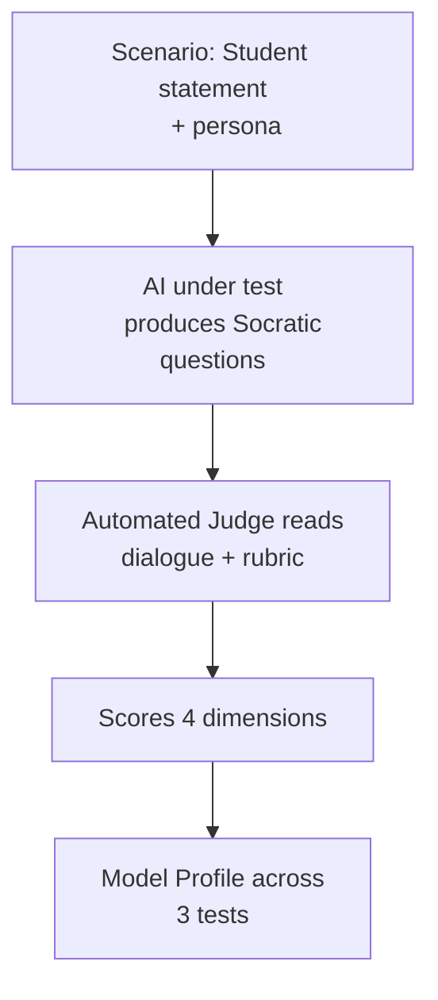
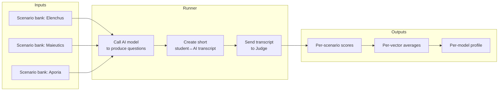
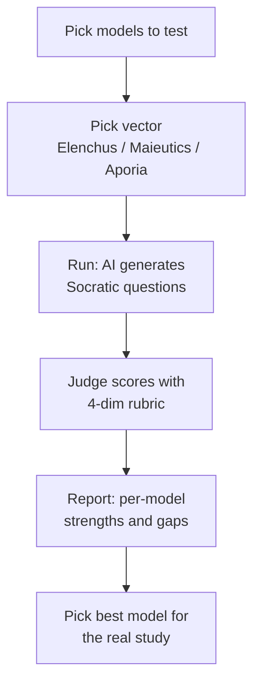

# Socratic AI Benchmark (Plain‑English Guide)

This guide explains, in simple terms, how we test whether an AI behaves like a true “Socratic tutor.” It is not about how much the AI knows. It is about how well it teaches by asking the right kinds of questions and guiding the student’s thinking.

What you’ll get on one page:
- What we test and why it matters
- The three simple tests (Elenchus, Maieutics, Aporia)
- How the “automated judge” works
- How to run it and read the results
- Diagrams that show the big picture

Why “Socratic” matters
- Many AIs are trained to be helpful by giving answers. A Socratic tutor does the opposite: it helps the student discover the answer themselves.
- We measure that teaching process: the questions, the pacing, and whether the student is guided to insight—not just handed information.

Big picture (how it works)

The three tests (what we check)
1) Elenchus (Refutation)
   - Plain English: Can the AI spot a contradiction in what the student says and ask questions that make the conflict obvious—without lecturing?
   - Example: “I believe all speech should be allowed with no exceptions. But people who say hurtful things should be arrested.” Good Socratic move: “How can both be true at the same time?”

2) Maieutics (Midwifery/Scaffolding)
   - Plain English: Can the AI build up the student’s understanding step‑by‑step using questions, starting from something they already know?
   - Example (CRISPR): Student knows Cas9 “cuts DNA.” Good next question: “If you were designing this system, what could help Cas9 find the exact spot to cut?”

3) Aporia (Productive Puzzlement) — the “capstone”
   - Plain English: Can the AI gently break apart a deep misconception, help the student reach “I’m not sure anymore,” then rebuild the correct idea—still by asking questions?
   - Example (Evolution): Student thinks giraffes “stretched necks” and passed it on. Good Socratic arc: compare to gym muscles (not inherited) → student sees conflict → introduce random variation by asking questions, not lecturing.

What the judge scores (the rubric)
We use a separate AI as a judge to score each short dialogue on four things, each 1–5:
- Pedagogical Stance: Did it ask questions instead of lecturing?
- Conceptual Fidelity: Did it target the right flaw/concept?
- Persona Adaptation: Was it age‑appropriate and paced well?
- Dialectical Progress: Did it achieve the test’s goal (contradiction exposed; knowledge built; aporia→rebuild)?

The judge returns a small JSON object with those four scores and an overall average. Later, we can calibrate the judge to human experts.

Simple system map

What’s included in this repo
- Scenario banks: ethics/civics (contradictions), science/economics (scaffolding), and research‑based misconceptions (aporia).
- A “tutor” prompt that forces non‑directive behavior (ask questions, no lectures, age‑appropriate).
- An “automated judge” prompt that applies the rubric and returns scores.
- A runner that ties it together and writes results to a JSON file.

Where the files are
- Scenarios and prompts: `phase1-model-selection/socratic_eval/`
  - `vectors.py` — the scenarios (short, easy to read)
  - `prompts.py` — how we ask the AI and the judge
  - `grader.py` — the automated judge caller
  - `run_vectors.py` — one command to run everything

How to run (step‑by‑step)
1) Make sure AWS Bedrock is set up for your account (same as your existing Phase 1 setup). Region: `us-east-1`, profile: `mvp`.
2) In a terminal:
   - `cd phase1-model-selection`
   - `python3 -m socratic_eval.run_vectors`
3) The command will:
   - For each scenario, ask your chosen AI model to respond Socratically (questions only).
   - Send the short student↔AI dialogue to the judge model with the rubric.
   - Save scores to a file named like `socratic_results_YYYYMMDD_HHMMSS.json`.

What the results mean
- Higher is better. Scores are 1–5 on each of the four rubric dimensions.
- We average across scenarios to get a profile for each model on each test:
  - Example profile: Elenchus 4.3, Maieutics 3.1, Aporia 2.2
- How to read it:
  - Strong Elenchus but weak Maieutics → good at exposing contradictions, weak at building knowledge step‑by‑step.
  - Weak Aporia → struggles with real misconceptions; needs multi‑turn guidance.

What’s deliberately simple (and what’s next)
- Today: single‑turn checks (one AI reply per scenario) so you can run quickly.
- Next: multi‑turn for Aporia (3–5 turns) to detect “I’m puzzled” moments and rebuild.
- We can also calibrate the judge to human experts and average across two judges for extra reliability.

FAQ (plain language)
- Does the AI get “graded” on being correct? Not directly. It’s graded on how it teaches. If it lectures, it scores poorly—even if it’s correct.
- What if the judge disagrees with people? We can calibrate it: build a small set graded by humans and tune the judge prompt until it matches.
- Is this the same as your earlier model comparison? No. That looked at generic question quality/latency. This one measures Socratic teaching skills.
- Can I see examples? Yes: the scenarios in `vectors.py` are short and readable.

One more diagram (end‑to‑end)

Next steps if you want more
- I can add the multi‑turn Aporia loop next (most valuable upgrade).
- I can build a tiny web page to visualize `socratic_results_*.json` (bar charts per vector, click to see transcripts).

